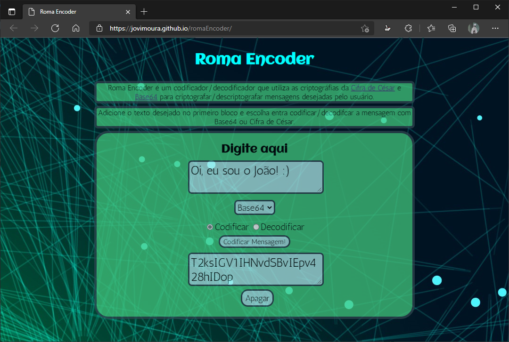

# Roma Encoder 🚀

Roma Encoder é um codificador/decodificador, que utiliza as criptográfias da <a href="https://pt.wikipedia.org/wiki/Cifra_de_C%C3%A9sar">Cifra de César</a> e <a href="https://pt.wikipedia.org/wiki/Base64">Base64</a> para criptografar/descriptografar mensagens
            desejadas pelo usuário.

## Imagem do Roma Encoder 💻

## Como usar?🤔

1° Você a mensagem que vai ser codificada/decodificada na primeira caixa.

2° Escolha qual criptografia usar

3° Se a criptografia escolhida for a Cifra de César, escolha uma chave e logo em seguida selecione a sua opção. Você pode codificar ou decodificar a mensagem e depois de escolher entre as duas opções clique no botão que irá aparecer(Codificar Mensagem/Decodificar Mensagem). O resultado aparecerá no quadrado abaixo.

Mas se a criptografia escohida for Base64, apenas marque a opção e aperte o botão que irá aparecer.

Também há um botão de apagar mensagem, caso você queira excluir a mensagem anterior.

## Tecnologias utilizadas 🦉

<ul>
    <li>HTML</li>
    <li>CSS</li>
    <li>Java Script</li>
</ul>

# Autor 😊

## João Victor dos Santos Moura
## Github : jovimoura
## Email : joaovictors.mouraa@gmail.com